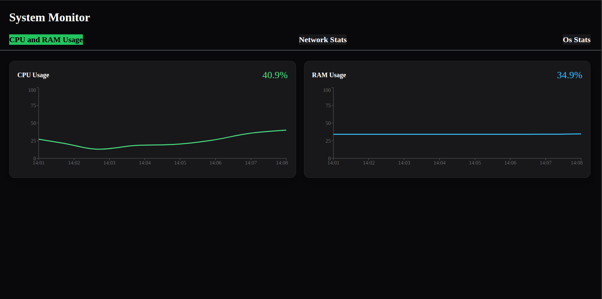
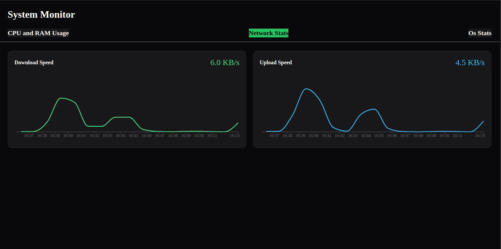
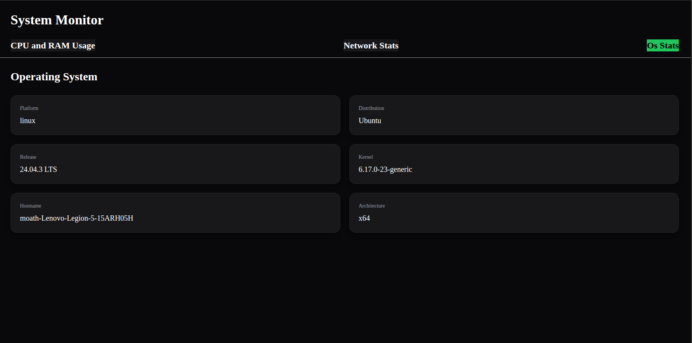

# Real-Time System Monitoring Dashboard

A real-time monitoring that streams live system information from the backend server and visualizes CPU usage, RAM usage, network activity, and operating system information in real time.

## Features

- Real-time CPU monitoring
- Real-time RAM monitoring
- Live network upload/download charts
- Operating system information panel
- WebSocket communication using Socket.IO
- Responsive UI 

## Tech Stack

### Frontend
- React
- TypeScript
- Tailwind CSS
- Recharts
- Socket.IO Client

### Backend
- Node.js
- Express
- TypeScript
- Socket.IO
- systeminformation

## Screenshots

### CPU and Memory Monitoring

### Network Monitoring

### OS Information

